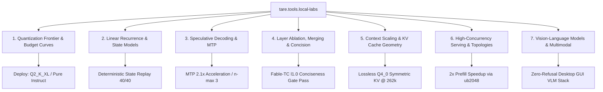

<div align="center">

# 🧪 tare.tools.local-labs

**Empirical Research Lab, Lifecycle Benchmarking Engine, and Local Inference Optimization Test Bench for High-Performance Open-Source LLMs.**

[](https://opensource.org/licenses/Apache-2.0)
[](https://github.com/augusto-scarvalho/tare.tools.local-labs/actions/workflows/ci.yml)
[](https://python.org)
[](#-hardware-envelope--environment)
[](#-llamacpp-fork-engineering)
[](#-deterministic-harness-qualification)
[](#-the-taretools-ecosystem-family)

<p align="center">
  <a href="#-why-taretoolslocal-labs">Why Local Labs</a> •
  <a href="#-the-production-golden-stack">Golden Stack</a> •
  <a href="#-the-7-research-pillars">7 Research Pillars</a> •
  <a href="#-master-empirical-findings--shootout">Model Shootout</a> •
  <a href="#-repository-architecture">Architecture</a> •
  <a href="#-tooling--campaign-index">Tooling & Ops</a> •
  <a href="#-quickstart--harness-verification">Quickstart</a>
</p>

</div>

---

## 🔬 Why tare.tools.local-labs?

Running cutting-edge generative AI models (Qwen 3.8 / 3.6, Llama 3.3, Mamba-2, Gemma-4 VLM) on **constrained consumer hardware (1x 24GB GPU + 64GB Host RAM)** requires rigorous systems engineering and uncompromising scientific validation.

Ad-hoc intuition fails when optimizing for latency, context length, and accuracy simultaneously. `tare.tools.local-labs` provides:

1. **Deterministic Scientific Method**: All claims are measured against the machine noise floor ($\sim 2.3\%$ paired scatter) using non-parametric statistics (exact sign tests, bootstrap CIs, Cliff's $\delta$).
2. **Lexicographic Promotion Gating**: Models advance through strict multi-stage criteria: *Eligibility $\rightarrow$ Correctness $\rightarrow$ Quality $\rightarrow$ Performance*.
3. **Low-Level Inference Kernel Engineering**: Custom authorial `llama.cpp` kernel levers (`B2b` KV host-buffer pinning, prefetch staging bypass, hot-expert caching).
4. **Pareto-Optimal Memory Geometries**: Pushing quantization boundaries (`Q2_K_XL` 9.9GB, symmetric `q4_0` KV) to fit 65k–262k active contexts on single-card workstations.

---

## 🏆 The Production Golden Stack

The consolidated, battle-tested deployment configuration for agentic software engineering and reasoning workloads on **24GB GPUs (RTX 3090 / RTX 4090 / ADA)**:

```bash
/home/augus/src/slop.cpp-main/build/bin/llama-server \
  -m /home/augus/models/qwen38-27b/Qwen3.8-27B-UD-Q2_K_XL.gguf \
  -fa on \
  --ctx-size 65536 \
  --cache-type-k q4_0 --cache-type-v q4_0 \
  --spec-type draft-mtp --spec-draft-n-max 3 \
  --batch-size 2048 --ubatch-size 2048 \
  --host 0.0.0.0 --port 8080
```

### 📊 Measured Performance Profile

| Metric Dimension | Baseline / Reference | Golden Stack Result | Net Impact |
|---|---|---|---|
| **VRAM Footprint** | 16.7 GB (`Q4_K_XL`) | **9.9 GB (`Q2_K_XL`)** | 🟢 **Frees 6.8 GB VRAM** for 65k+ KV buffers |
| **Coding Accuracy** | 86.7% (Thinking Mode) | **95.0% (Instruct Mode)** | 🟢 **+8.3% pass@1** on HumanEval+ ($n=60$) |
| **Math Reasoning** | 90.0% (FP16 Base) | **90.0% (`Q2_K_XL`)** | 🟢 **100% Quality Parity** on MATH-500 L5 |
| **Speculative Speedup** | 39.5 tok/s (No Spec) | **83.6 tok/s (MTP $n=3$)** | ⚡ **~2.1x Throughput Gain** |
| **Prefill Ingestion** | 137.8s (`ubatch=512`) | **67.9s (`ubatch=2048`)** | ⚡ **50.7% TTFT Latency Reduction** at 128k |
| **Context Retrieval** | 100% (16-bit) | **100% (`q4_0` Symmetric KV)** | 🟢 **Lossless Needle Recall** up to 65k+ |

---

## 🏛️ The 7 Research Pillars



For the comprehensive scientific catalog of all 7 pillars, see **[`docs/RESEARCH_CATALOG.md`](docs/RESEARCH_CATALOG.md)**.

---

## ⚔️ Master Empirical Findings & Shootout

### Deterministic Coding Shootout ($n=60$ HumanEval+ Market-R0)

Scored via `evalplus` under identical greedy decoding conditions ($T=0$):

| Model Candidate | Origin & Lineage | Configuration | Pass@1 | Timeout / Truncation | Verdict |
|---|---|---|---:|---:|---|
| **Qwen3.8-27B Base** | Qwen Official / Unsloth UD | **Instruct (`enable_thinking: false`)** | **95.0%** | **0 / 60 (0%)** | 🏆 **Production Champion** |
| Qwen3.8-27B Base | Qwen Official | Reasoning Low (`effort=low`) | 93.3% | 0 / 60 (0%) | 🥈 Algorithmic Fallback |
| ThinkingCap-3.6 | BottleCapAI HF Fine-tune | Thinking Mode | 93.3% | 0 / 60 (0%) | 📊 3.6 Efficiency Reference |
| **Fable-TC l1.0** | **Augusto Carvalho Merge** | **Instruct / Concise** | **88.3%** | **0 / 60 (0%)** | 🛡️ **Uncensored Agent (3.6)** |
| Qwen3.8-27B Base | Qwen Official | Reasoning Medium (`effort=med`) | 88.3% | 0 / 60 (0%) | ⚠️ Sub-optimal for code |
| Qwen3.8-27B Base | Qwen Official | Reasoning XHigh (Default) | 45.0% | 31 / 60 (51.7%) | ❌ Truncation Trap |
| Fable-Fusion-711 | DavidAU Community Merge | Thinking / NEO | 40.0% | 36 / 60 (60.0%) | ❌ Non-Terminating Loops |

### 🔬 Core Scientific Insights

1. **The Reasoning Inversion Paradox**: In deterministic coding tasks, expanding internal thought monologues correlates *negatively* with output correctness ($95\% \to 93\% \to 88\% \to 45\%$) due to self-doubt recursion and token limit exhaustion.
2. **The 2D Quantization Boundary**: While 1D scalar tests remain flat down to 2.4-bit (`IQ2_M`), 2D Needle-in-a-Haystack reveals that `IQ2_M` drops deep needles at $\ge 32k$. **`Q2_K_XL` (9.9GB)** is the true mathematical Pareto floor.
3. **KV Cache Symmetry**: Asymmetric KV cache (`q8_0/q4_0`) causes a **-57% throughput penalty** due to GPU FlashAttention falling back to CPU. **Symmetric `q4_0/q4_0`** is 100% GPU-fused and lossless.
4. **Fable-TC Authorial Merge**: The author-created `fable-tc-l1.0` merge ($W_{\text{Fable}} + 1.0 \times (W_{\text{TC}} - W_{\text{base}})$) achieved **98.3% GSM8K**, slashed reasoning tokens by **-54.8%**, and won blind 4-judge writing parity.

---

## ⚙️ llama.cpp Fork Engineering

Inferencing is accelerated by a custom-engineered `llama.cpp` fork (`llama.cpp-master @ lifecycle`, base `720d7fa40`):

```
┌───────────────────────────────────────────────────────────────────────────┐
│ Host System RAM (64 GB DDR4)                                              │
│   • Pinned Expert Weights (cudaHostRegister mmap)                         │
│   • [B2b] Pinned Host KV Buffers (Direct DMA for --no-kv-offload)         │
└─────────────────────────────────────┬─────────────────────────────────────┘
                                      │ PCIe Gen4 x16 Direct DMA Streams
┌─────────────────────────────────────▼─────────────────────────────────────┐
│ NVIDIA GeForce RTX 3090 (24 GB VRAM)                                      │
│   • Active Base Model Weights & Attention Heads                           │
│   • Top-N Resident Hot Expert Cache (llama-moe-trace)                     │
│   • Symmetric Q4_0 FlashAttention KV Cache (Lossless up to 262k)          │
│   • Block-64 Next-N Multi-Token Prediction Head (Draft Speculation ~2.1x) │
└───────────────────────────────────────────────────────────────────────────┘
```

* **`[B2b]` KV Host-Buffer Pinning (`GGML_KV_PIN_HOST=1`)**: Novel authorial patch in [`patches/b2b-kv-host-pin.patch`](patches/b2b-kv-host-pin.patch) yielding **+17% throughput** during deep context offloading.
* **Prefetch Skip-When-Pinned (`--prefetch-experts N`)**: Scheduler refinement eliminating staging copy penalties (**+58% prefill boost**).
* **3-Tier Qualification Suite (`tools/scripts_sh/bless_fork.sh`)**: Verifies G1 host-pinning, G2 MTP draft identity, and G3 offload coherence (**3/3 PASS**).

---

## 📁 Repository Architecture

```text
tare.tools.local-labs/
├── src/model_lifecycle/        # Core Python package & lifecycle analysis engine
│   ├── analysis/               # Multi-stage promotion gates, statistics, QA checks
│   ├── collectors/             # GPU telemetry, streaming token recorders
│   ├── control_plane/          # Guard rails, run planners, recovery policies
│   ├── reports/                # A/B diff analyzers, status report generators
│   └── servers/                # Llama-server & SGLang runner adapters
│
├── tools/                      # 🛠️ Research Tooling & Benchmarks (tools/README.md)
│   ├── analysis/               # A/B analyzers, GGUF inspectors, matrix scorers
│   ├── benchmarks/             # HumanEval+, GSM8K, Concision, MTP, DSpark
│   ├── gates/                  # Promotion gates, MTP verifiers, Gate 3 quorums
│   ├── probes/                 # TTFT, KV-cache, NIAH context, VLM refusal probes
│   ├── scripts_sh/             # Linux / WSL qualification and profiling scripts
│   └── scripts_ps1/            # Windows / PowerShell management & GPU recovery
│
├── ops/                        # 🚀 Operational Playbooks (ops/README.md)
│   ├── qwen38-bringup/         # Active Qwen 3.8-27B bringup, quant frontier, serve.sh
│   ├── rnn-campaign/           # Recurrent state models (Mamba-2, GDN, TPTT, NoLiMa)
│   ├── serving-campaign/       # Concurrency benchmarks, slot topologies, ubatch
│   ├── fork-consolidation/     # Llama.cpp multi-tree build archaeology & audit
│   └── gpu-stability/          # NVIDIA driver profiles & reboot prevention
│
├── docs/                       # 📚 Curated Scientific Documentation
│   ├── HANDOFF.md              # Living master handoff (Realizado / Em Andamento / Encerrado)
│   ├── RESEARCH_CATALOG.md     # Master scientific catalog & empirical taxonomy
│   ├── campaigns/              # Focused empirical campaign deep-dives (a1 to vlm)
│   └── architecture/           # System design & relay protocol specifications
│
├── workloads/                  # 📦 Test Fixtures, Gate 3 Datasets & VLM Mockups
├── patches/                    # Custom engine kernel patches (B2b KV host-pin)
├── runs/                       # Durable empirical run logs (JSON/JSONL evidence)
└── tests/                      # Deterministic harness verification (LAB-QA-001)
```

---

## 🛠️ Tooling & Campaign Index

| Resource | Scope | Description |
|---|---|---|
| 📋 **[`docs/HANDOFF.md`](docs/HANDOFF.md)** | **Living State** | Master ledger tracking **Realizado** (10 milestones), **Em Andamento** (P1–P5 backlog), and **Encerrado** (closed hypotheses). |
| 📖 **[`docs/RESEARCH_CATALOG.md`](docs/RESEARCH_CATALOG.md)** | **Scientific Catalog** | Canonical research index covering all 7 pillars, methodologies, Pareto curves, and statistical deltas. |
| 🛠️ **[`tools/README.md`](tools/README.md)** | **Tooling Index** | Comprehensive catalog of 60+ benchmarks, latency probes, promotion gates, and analysis scripts. |
| 🚀 **[`ops/README.md`](ops/README.md)** | **Playbooks** | Operational guide for active bring-ups, recurrence suites, and serving campaigns. |

---

## 🚀 Quickstart & Harness Verification

### 1. Deterministic Harness Qualification (< 2 seconds, no GPU required)
```bash
python tests/benchmark_harness/benchmark_harness_selftest.py
# Expected output: LAB-QA-001: 23/23 passed — ALL GREEN
```

The repository CI runs the same deterministic checks without a GPU:

```bash
python -m compileall -q src tools tests benchmark_harness_qa.py
python -m pytest -q
python tests/benchmark_harness/benchmark_harness_selftest.py
```

### 2. Launch Production Inference Server
```bash
bash ops/wsl/wslx.sh ops/qwen38-bringup/serve.sh
```

### 3. Run Context Retrieval Probe (Needle-in-a-Haystack)
```bash
bash ops/wsl/wslx.sh ops/qwen38-bringup/ctx_curve.sh -- CTX=65536
```

### 4. Evaluate Multi-Stage Promotion Gate
```python
from model_lifecycle.analysis.promotion import evaluate_promotion, PromotionMargins

# Evaluates candidates: eligibility -> correctness -> quality -> latency
result = evaluate_promotion(control_records, treatment_records)
print(f"Promotion verdict: {result.verdict} (p-value: {result.p_value})")
```

---

## 🌐 The tare.tools Ecosystem Family

| Repository | Role in Ecosystem | Primary Architecture |
|---|---|---|
| **`tare.tools.local-labs`** | **Inference & Model Lifecycle Lab** | Empirical Benchmarks, `slop.cpp` Integration, Pareto Frontier |
| **[`slop.cpp`](https://github.com/augusto-scarvalho/slop.cpp)** | **AI-Augmented Inference Engine** | CUDA Levers (`B2b` Pinning, Skip-Staging Prefetch, GDN TF32), MTP |
| **[`tare.tools.kernel`](https://github.com/augusto-scarvalho/tare.tools.kernel)** | **Agent OS 2.0 Microkernel** | 5-Plane Architecture, CAS WAL, Single-Writer Microkernel |
| **[`tare.tools.harness`](https://github.com/augusto-scarvalho/tare.tools.harness)** | **Universal Agent Harness** | Agnostic Execution Harness, Validation Gates, Handoffs |
| **[`tare.tools.dialog-engine`](https://github.com/augusto-scarvalho/tare.tools.dialog-engine)** | **Multi-Agent Deliberation** | Structured Dialogue Loops, Consensus Protocols |
| **[`tare.tools.specgraph`](https://github.com/augusto-scarvalho/tare.tools.specgraph)** | **Formal Specification Engine** | Spec Graphs, Dependency Resolution, Formal Verification |
| **[`tare.tools.research`](https://github.com/augusto-scarvalho/tare.tools.research)** | **Research & Architecture ADRs** | Architecture Decision Records, Ecosystem North Stars |

---

## 📄 License

Licensed under the **Apache License, Version 2.0**. See the [LICENSE](LICENSE) file for terms.
