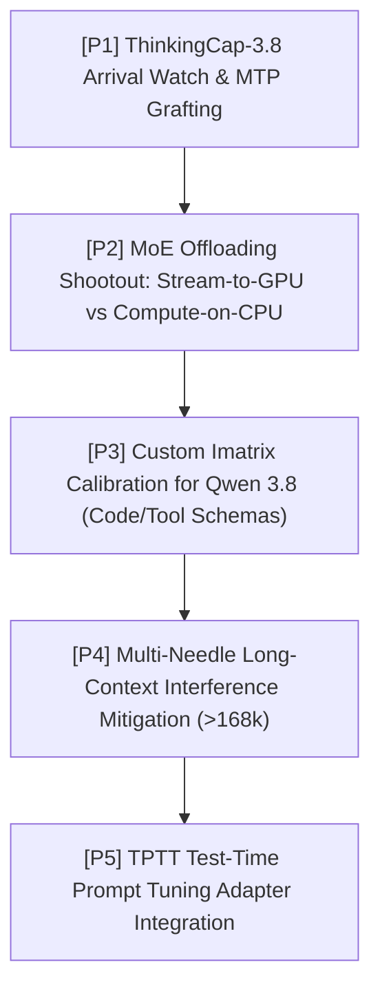

<div align="center">

# 📋 tare.tools.local-labs — Master Handoff & Living Backlog

**Canonical State Ledger: Settled Milestones (Realizado), Active Engineering Backlog (Em Andamento), and Falsified Epistemic Bounds (Encerrado).**

[](https://opensource.org/licenses/Apache-2.0)
[](#-1-environment--operational-baseline)
[](#-2-realizado-settled--operationalized-milestones)
[](#-3-em-andamento--backlog-ativo-in-progress--queued-tracks)
[](#-4-encerrado--falsificado--negativo-closed-hypotheses)

<p align="center">
  <a href="#-1-environment--operational-baseline">Environment</a> •
  <a href="#-2-realizado-settled--operationalized-milestones">Realizado (Completed)</a> •
  <a href="#-3-em-andamento--backlog-ativo-in-progress--queued-tracks">Em Andamento (Backlog)</a> •
  <a href="#-4-encerrado--falsificado--negativo-closed-hypotheses">Encerrado (Closed)</a> •
  <a href="#-5-quick-start-runbook-for-incoming-operators">Operator Runbook</a>
</p>

</div>

---

> **Document Role**: Canonical, living state ledger for `tare.tools.local-labs`. It materializes what has been **settled and operationalized** (Realizado), what is **actively in progress or queued** (Em Andamento), and what hypotheses have been **falsified and closed** (Encerrado). Incoming agents, operators, and developers must read this first after a context reset.

---

## 🖥️ 1. Environment & Operational Baseline

- **Node Identity**: `aaaaa` (Tailscale / LAN host `100.107.245.30` / `192.168.15.66`).
- **Operating Environment**: Windows 11 Pro + WSL2 (Ubuntu 24.04, Linux kernel 6.6.x).
- **Compute Hardware**:
  - GPU: NVIDIA GeForce RTX 3090 (24GB GDDR6X, Ampere `sm_86`, PCIe Gen4 x16).
  - Host RAM: 64 GB DDR4 (page-locked DMA enabled via `cudaHostRegister`).
  - Storage: High-speed NVMe PCIe 4.0 SSD.
- **Inference Runtime Engine**:
  - Primary: `/home/augus/src/llama.cpp-master/build/bin/llama-server` (branch **`lifecycle`**, base `720d7fa40`).
  - Runner script: `ops/wsl/wslx.sh` (detached execution in WSL with background logging).

---

## ✅ 2. Realizado (Settled & Operationalized Milestones)

The following architectural, model-level, and systems milestones have been fully validated, passed all qualification gates, and are active in production:

| Milestone ID | Area | Achievement & Key Empirical Metrics | Production Configuration / Artifact |
|---|---|---|---|
| **`REAL-01`** | **Model Selection** | **Qwen 3.8-27B Base Instruct Promoted**: Achieved **95.0% pass@1** on HumanEval+ ($n=60$), outperforming all reasoning modes and 3.6 predecessors. | GGUF: `Qwen3.8-27B-UD-Q2_K_XL.gguf`<br>Flag: `chat_template_kwargs={"enable_thinking": false}` |
| **`REAL-02`** | **Quantization Floor** | **`Q2_K_XL` (9.9GB) Pareto Sweet Spot**: Frees ~7GB VRAM vs Q4 with zero quality regression on coding (0.896) or math (90%) and 100% deep long-context recall up to 65k+. | Quant: `UD-Q2_K_XL` (Unsloth dynamic) |
| **`REAL-03`** | **Speculative Decoding** | **MTP Speculative Decoding ~2.1x Acceleration**: Draft head at block 64 achieves 83.4% draft acceptance on deterministic code generation. | Flags: `--spec-type draft-mtp --spec-draft-n-max 3` |
| **`REAL-04`** | **3.6 Uncensored Agent** | **`fable-tc-l1.0` Authorial Merge (Augusto Carvalho)**: Full-rank task arithmetic ($W_{\text{Fable}} + \lambda(W_{\text{TC}} - W_{\text{base}})$) with $\lambda=1.0$ established **98.3% GSM8K**, **-54.8% reasoning tokens**, and passed Gate 3 writing parity. | Artifact: `models/merges/fable-tc-l1.0-Q4_K_M.gguf` |
| **`REAL-05`** | **KV Cache Optimization** | **Lossless Symmetric `q4_0` KV Cache**: FlashAttention fused CUDA kernels run 100% on GPU at 88.55 t/s, reaching native 262k context losslessly in VRAM. | Flags: `--cache-type-k q4_0 --cache-type-v q4_0 -fa on` |
| **`REAL-06`** | **Inference Engine Kernel** | **`[B2b]` KV Host-Buffer Pinning (`GGML_KV_PIN_HOST=1`)**: Authorial patch allocating `CUDA_Host` memory for `--no-kv-offload`, eliminating bounce-buffers (+17% speedup at 128k context). | Patch: [`patches/b2b-kv-host-pin.patch`](file:///C:/projects/local-model-lifecycle/patches/b2b-kv-host-pin.patch) |
| **`REAL-07`** | **Engine Scheduler** | **Prefetch Skip-When-Pinned**: Authorial refinement bypassing staging buffers on pre-pinned memory (+58% prefill speedup on small cards). | Flags: `--prefetch-experts N` / `GGML_SCHED_PREFETCH_EXPERTS` |
| **`REAL-08`** | **Linear Recurrent State** | **Mamba-2 Deterministic State Reload**: Verified bit-exact recurrent state reload (40/40) on official fast-path CUDA kernels. | Specification: [`RNN_MEMORY_CACHING_SPEC.md`](file:///C:/projects/local-model-lifecycle/docs/campaigns/rnn-mamba/RNN_MEMORY_CACHING_SPEC.md) |
| **`REAL-09`** | **Micro-Batch Scaling** | **UBatch 2048 Ingestion Speedup**: Doubled prefill throughput (+100.8%), cutting 128k context TTFT from 137.8s to 67.9s on PCIe Gen4 x16. | Flags: `--batch-size 2048 --ubatch-size 2048` |
| **`REAL-10`** | **Vision-Language Model** | **Zero-Refusal Multimodal UI Telemetry**: Homologated Gemma-4 12B/26B VLM pipeline for desktop screen localization and GUI element parsing. | Documentation: [`docs/campaigns/vlm/M_A_VLM.md`](file:///C:/projects/local-model-lifecycle/docs/campaigns/vlm/M_A_VLM.md) |

---

## 🚧 3. Em Andamento & Backlog Ativo (In Progress / Queued Tracks)

The prioritized research roadmap for upcoming iterations:



### Backlog Detail & Action Plans

#### `ACT-01` [Priority P1]: `ThinkingCap-Qwen3.8-27B` Arrival Watch & MTP Grafting
- **Objective**: Monitor BottleCapAI for the release of ThinkingCap on Qwen 3.8.
- **Trigger**: If upstream lands, immediately evaluate on HumanEval+ $n=60$.
- **Action**: Verify whether MTP tensors are preserved; if stripped, graft draft head via `a4lg/Qwen3.8-27B-MTP-ONLY-GGUF` and benchmark speculative acceptance rate.

#### `ACT-02` [Priority P2]: MoE Offloading Shootout — Stream-to-GPU vs. Compute-on-CPU
- **Objective**: Head-to-head empirical comparison of the two MoE offload paradigms on host `aaaaa`:
  1. *Philosophy (a) Stream-to-GPU*: Our consolidated `lifecycle` build with `cudaHostRegister` direct DMA.
  2. *Philosophy (b) Compute-on-CPU*: `ik_llama.cpp` and `KTransformers` running vectorized AVX-512 CPU GEMM.
- **Metric**: Decode throughput (tokens/sec) and TTFT across 35B MoE architectures at `ncmoe` $\in \{4, 8, 16, 26\}$.

#### `ACT-03` [Priority P3]: Custom Imatrix Calibration for Qwen 3.8
- **Objective**: Generate a domain-specialized importance matrix (`imatrix`) calibrated on agentic tool schemas, JSON call structures, and multi-turn coding dialogs.
- **Condition**: Currently gated behind `ops/qwen38-bringup/CUSTOM_QUANT_DECISION.md` (only trigger if community UD quants exhibit tool-call formatting drift).

#### `ACT-04` [Priority P4]: Multi-Needle Interference Research at $\ge 168k$ Context
- **Objective**: Investigate the forgetting mechanism observed in Phase 3 where a single needle succeeds at 166k (100% recall), but 32–48 near-identical needles suffer interference dropouts.
- **Action**: Test selective YaRN frequency adjustments and RoPE scaling parameters in `tools/probes/context_probe.py`.

#### `ACT-05` [Priority P5]: TPTT (Test-Time Prompt Tuning) Adapter Integration
- **Objective**: Evaluate test-time prompt adaptation on dense Qwen 3.8 checkpoints to dynamically adjust prompt representations during multi-agent deliberation.

---

## 🛑 4. Encerrado / Falsificado / Negativo (Closed Hypotheses)

To preserve scientific hygiene and avoid re-exploring dead ends, the following hypotheses are formally closed:

1. ❌ **Thinking Mode for Coding Swarms (`EXP-QWEN38-BUDGET`)**:
   - *Verdict*: Closed / Negative. Instruct mode strictly outperforms thinking mode (95.0% vs 86.7% @ 8192 budget; default `xhigh` collapses to 45.0% due to 31/60 timeouts).
2. ❌ **Asymmetric KV Cache (`q8_0` keys / `q4_0` values) (`EXP-A3-KV`)**:
   - *Verdict*: Closed / Negative. Llama.cpp FlashAttention lacks asymmetric CUDA kernels, falling back to CPU with a -57% throughput penalty.
3. ❌ **Windowed MTP Attention (`EXP-A1-MTP`)**:
   - *Verdict*: Closed / Negative. Draft KV tax does not dominate within native 262k context. Un-windowed MTP throughput gains increase monotonically with depth (+176% at ceiling).
4. ❌ **In-Run Recurrent State Recovery (`EXP-RNN-07A-R1`)**:
   - *Verdict*: Closed / Falsified. Strict single-trajectory in-run capture on NoLiMa ($N=64$) showed $\Delta \approx 0$ between intermediate state snap and final output.
5. ❌ **Low-Rank SVD LoRA for Concision Transfer (`A2_THINKINGCAP.md`)**:
   - *Verdict*: Closed / Negative. Rank-64 SVD LoRA failed reconstruction (length ratio 1.93, fidelity 0.26). Full-rank task arithmetic (`fable-tc-l1.0`) is required.
6. ❌ **Extreme Quantization `IQ2_M` for Long-Context Deploy (`EXP-QWEN38-QUANT`)**:
   - *Verdict*: Closed / Bounded. `IQ2_M` (9.6GB) introduces non-deterministic retrieval dropouts at $\ge 32k$ context. `Q2_K_XL` (9.9GB) is the true Pareto floor.

---

## 🚀 5. Quick-Start Runbook for Incoming Operators

### Boot Standard Production Server (Qwen 3.8-27B Instruct)
```bash
/home/augus/src/llama.cpp-master/build/bin/llama-server \
  -m /home/augus/models/qwen38-27b/Qwen3.8-27B-UD-Q2_K_XL.gguf \
  -fa on \
  --ctx-size 65536 \
  --cache-type-k q4_0 --cache-type-v q4_0 \
  --spec-type draft-mtp --spec-draft-n-max 3 \
  --batch-size 2048 --ubatch-size 2048 \
  --host 0.0.0.0 --port 8080
```

### Run Deterministic QA Harness Qualification
```bash
python tests/benchmark_harness/benchmark_harness_selftest.py
# Must report: LAB-QA-001: 16/16 passed — ALL GREEN
```

### Execute Long-Context Needle-in-a-Haystack Probe
```bash
bash ops/wsl/wslx.sh ops/qwen38-bringup/ctx_curve.sh -- CTX=65536
```
