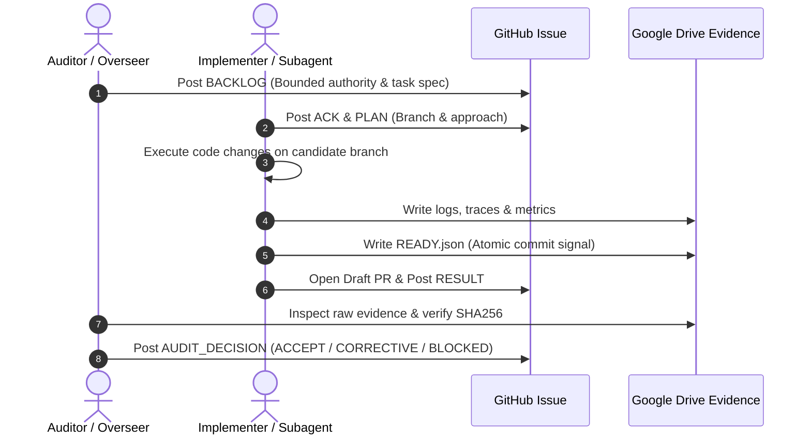

# Local Labs Relay Protocol (tare.tools.local-labs) 📡

This document defines the **GitHub Issue ⇄ Google Drive Relay Architecture** used for distributed coordination between human developers, autonomous auditor agents, and implementation workers.

---

## 🏛️ Relay Architecture Principles

1. **GitHub Issue = Coordination & Canonical Provenance (Not Execution Authority)**:
   - The GitHub Issue thread carries the sequential message lifecycle: `BACKLOG` $\to$ `ACK` $\to$ `PLAN` $\to$ `RESULT` $\to$ `AUDIT_DECISION`.
   - The thread acts as an immutable, timestamped ledger of what was requested, agreed upon, and verified.
2. **Google Drive = Bulky & Ephemeral Evidence Transport**:
   - High-volume binary artifacts, raw traces, hardware telemetry, profiler dumps, and scratch logs are written to the authorized Drive tree (`temporary-evidence/agent-relay/tare.tools.local-labs/`).
   - Keeps the Git repository lightweight, fast, and pristine.
3. **Atomic `READY.json` Handshake**:
   - An evidence package on Drive is only considered complete once all payload files are flushed and `READY.json` (containing payload SHA256 checksums) is written last.
4. **Strict Secret Confinement**:
   - Zero credentials, tokens, SSH keys, or proprietary weights are transmitted through the relay. All secrets are sourced at runtime from host keyrings or environment variables.

---

## 🔄 Standard Message Flow



---

## 📄 Protocol Message Schemas

### 1. `ACK.json`
```json
{
  "protocol": "tare.tools.relay/v1",
  "kind": "ACK",
  "issue_id": 42,
  "agent_id": "implementer-qwen38-worker",
  "status": "ACCEPTED",
  "candidate_branch": "agent/qwen38-quant-frontier",
  "timestamp": "2026-08-18T19:00:00Z"
}
```

### 2. `RESULT.json`
```json
{
  "protocol": "tare.tools.relay/v1",
  "kind": "RESULT",
  "issue_id": 42,
  "agent_id": "implementer-qwen38-worker",
  "status": "READY_FOR_AUDIT",
  "candidate_commit": "c3d9eed",
  "evidence_path": "temporary-evidence/agent-relay/tare.tools.local-labs/issue-42/",
  "ready_manifest_sha256": "3b2ce642a4919db897a198e6438e3...",
  "summary": "Quantization frontier evaluated. Q2_K_XL selected as Pareto floor.",
  "timestamp": "2026-08-18T19:30:00Z"
}
```
