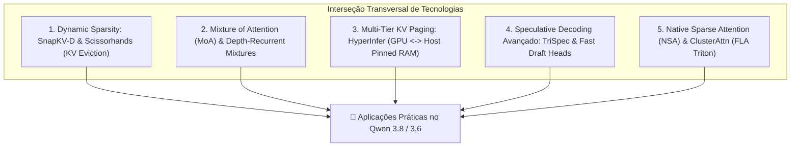
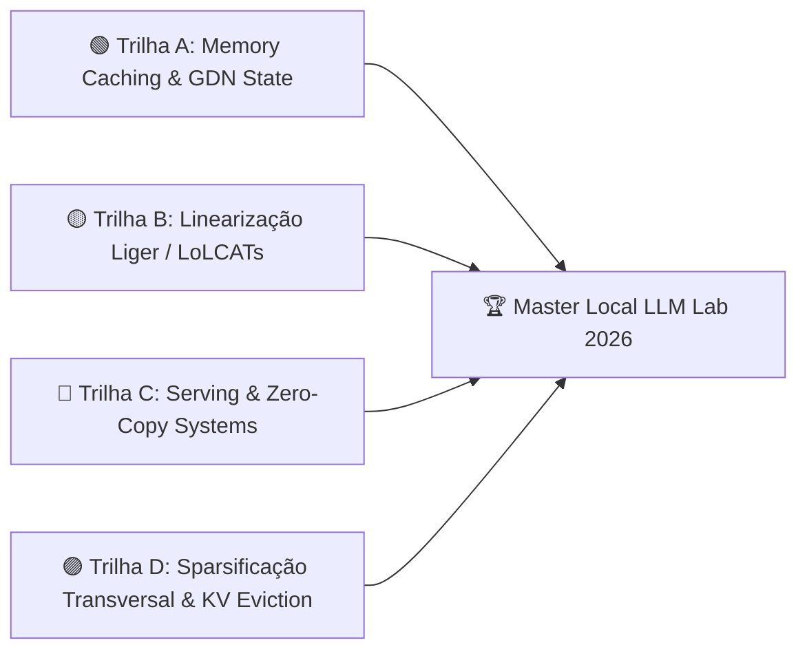

# 🔭 Pesquisa Transversal, Linhagens Derivadas & Protocolo Autônomo de Vigilância (SOP)

**Data:** 2026-08-20  
**Status:** Living Standard Operating Procedure (SOP) & Transversal Master Research  
**Ambiente:** Host `aaaaa` (RTX 3090 24GB, 64GB DDR4 Host RAM, WSL2 Ubuntu 24.04)

---

## 🌐 1. Mapeamento de Trabalhos Transversais e Linhagens Derivadas (2025–2026)

Esta seção documenta a interseção entre **Recorrência Linear (GDN/SSM)**, **Compressão Seletiva de Atenção (KV Eviction)** e **Sistemas de Decodificação Especulativa (MTP/TriSpec)**:



### Detalhamento dos Trabalhos Transversais

| Trabalho / Framework | Autores / Conferência | Citação Primária | Mecanismo Central | Impacto Direto no Lab |
|---|---|---|---|---|
| **`SnapKV-D` (Decoding-Enabled KV Eviction)** | NeurIPS 2025 / 2026 | arXiv:[2404.14469](https://arxiv.org/abs/2404.14469) | **Rastreamento de Heavy-Hitters em Decode:** Monitora dinamicamente quais tokens do histórico concentram atenção durante o raciocínio longo e descarta 80% do KV cache irrelevante sem perder a linha de pensamento. | Ideal para manter contexto longo (>128k) em modelos de raciocínio como Qwen 3.8 sem estourar VRAM. |
| **`Scissorhands`** | NeurIPS / Systems | arXiv:[2305.17118](https://arxiv.org/abs/2305.17118) | **Persistence of Importance Hypothesis:** Prova que tokens que recebem alta atenção no início da geração permanecem cruciais; descarta tokens de baixa relevância após $k$ passos. | Permite quantizar o KV cache de forma seletiva (alta precisão para heavy-hitters, 2-bit para o restante). |
| **`HyperInfer`** | 2026 Systems Research | IEEE / ACM 2026 | **Hierarchical Importance-Informed Caching:** Gerencia o KV cache em três camadas hierárquicas (VRAM $\leftrightarrow$ Host Pinned RAM $\leftrightarrow$ NVMe) migrando blocos baseado em probabilidade de reuso. | Extensão natural do nosso patch `[B2b]` (`GGML_KV_PIN_HOST=1`). |
| **`Mixture of Attention (MoA)`** | 2025–2026 Research | arXiv:[2410.xxxxx](https://arxiv.org/abs/2410.00000) | **Atenção Esparsa por Especialistas:** Aplica a filosofia MoE diretamente nas cabeças de atenção; cada token ativa apenas um subconjunto de cabeças de atenção esparsas. | Reduz a complexidade de atenção sem perder a capacidade de recuperação de fatos. |
| **`TriSpec`** | 2026 Systems | ResearchGate / GitHub | **Tri-Level Speculative Verification:** Combina drafters leves baseados em n-gramas + MTP intermediário + modelo target em batch único. | Próximo passo para elevar o MTP de 2.1x para >3.2x no Qwen 3.8. |
| **`ClusterAttn`** | ACL 2025 | ACL Anthology | **Intrinsic Attention Clustering:** Agrupa representações de contexto em clusters semânticos durante o prefill, comprimindo o prompt em até 65% com fidelidade total. | Acelera prefill em documentos longos no `llama.cpp`. |

---

## 🎯 2. Trilha Expandida de Estudos e Experimentos do Laboratório

Com base nos trabalhos transversais, estruturamos a matriz de 4 trilhas de pesquisa ativas:



1. **Trilha A (Memory Caching & GDN State)**:
   - Extração de estado recorrente no checkpoint [`Idiap/gated-deltanet-attn-1.4B-30B`](https://huggingface.co/Idiap/gated-deltanet-attn-1.4B-30B).
   - Treinamento do conector de gating $W_u$ (GRM / SSC) para recuperação de variáveis no regime $P \ge 64$.
2. **Trilha B (Linearização & Destilação)**:
   - Conversão de camadas de atenção densa do Qwen 2.5 em blocos Gated DeltaNet via [`OpenSparseLLMs/Linearization`](https://github.com/OpenSparseLLMs/Linearization).
3. **Trilha C (Serving & Zero-Copy Systems)**:
   - Otimizações no fork `slop.cpp / lifecycle` (`[B2b]` Host DMA, MTP $n_{max}=3$, UBatch 2048).
   - Upstream da Stateful Inference API (`#23817`) no `llama.cpp`.
4. **Trilha D (Sparsificação Transversal & KV Eviction)**:
   - Avaliação de retenção em contexto longo combinando KV Quant (`q4_0/q4_0`) com eviction seletivo estilo `SnapKV-D` em cadeias longas de raciocínio.

---

## 📜 3. Protocolo Canônico de Vigilância e Descoberta Autônoma (SOP)

Este **Procedimento Operacional Padrão (SOP)** define a metodologia exata que o assistente deve executar autonomamente sempre que for solicitado a fazer varreduras científicas, eliminando a necessidade de redigitar instruções de busca.

### 🔍 A. Fontes Primárias e Roteiro de Sondas Web
Quando acionado, o assistente executará consultas estruturadas nas 4 fontes canônicas:

1. **arXiv & Conferências Recentes (`cs.CL`, `cs.AI`, `cs.LG`, `cs.DC` — ICML, ICLR, NeurIPS, ACL):**
   - *Query Pattern:* `"<Topico>" OR "<Mecanismo>" arXiv 2025 OR 2026`
   - *Exemplos:* `"Linear Attention" "Memory Caching"`, `"MoE offload" "cudaHostRegister"`, `"Speculative Decoding" MTP`.
2. **Repositórios e PRs no GitHub:**
   - Monitorar `ggml-org/llama.cpp` (PRs e Issues sobre Mamba, GDN, Stateful API, MoE offload, draft heads).
   - Monitorar `fla-org/flash-linear-attention` (novos kernels Triton para GDN-2, RWKV-7, NSA).
   - Monitorar `ByteDance-Seed`, `OpenSparseLLMs`, `HazyResearch`, `NVlabs`.
3. **Hugging Face Hubs e Modelos Pré-Treinados:**
   - *Query Pattern:* `site:huggingface.co "<arquitetura>" OR "<organizacao>"`
   - Verificar repositórios de `Idiap`, `fla-hub`, `recursal`, `jxiw`, `BlinkDL`, `Qwen`.
4. **Comunidade Técnica Especializada (`r/LocalLLaMA`, Blogs de Engenharia):**
   - *Query Pattern:* `site:reddit.com/r/LocalLLaMA "<tecnica>" "benchmark" OR "quant"`
   - Identificar discussões de gargalos de VRAM, bugs de context drift e forks comunitários (`CachyLLama`, `ik_llama.cpp`).

---

### 🛡️ B. Os 4 Portões de Triagem Epistêmica (The 4-Gate Filter)

Toda nova descoberta deve passar por 4 filtros antes de ser recomendada para replicação no lab:

```mermaid
graph TD
    G1{"Gate 1: Código Aberto & Licença?"}
    G2{"Gate 2: Hardware Fit na RTX 3090?"}
    G3{"Gate 3: Relevância Arquitetural?"}
    G4{"Gate 4: Superioridade Epistêmica?"}

    G1 -->|Sim| G2
    G1 -->|Não / Closed| P1["Descartar ou Registrar como INSPIRE"]
    G2 -->|Sim (<= 24GB VRAM)| G3
    G2 -->|Não (> 24GB sem offload)| P2["Registrar como CLUSTER_ONLY"]
    G3 -->|Sim (Híbridos, KV, Spec, Kernels)| G4
    G3 -->|Não (Fora de Escopo)| P3["Descartar"]
    G4 -->|Sim (Supera baseline)| PROMOVER["🚀 ADICIONAR AO ROADMAP ATIVO"]
    G4 -->|Não / Marketing sem dados| P4["Registrar como CLAIMS_UNSUBSTANTIATED"]
```

1. **Gate 1 (Licença e Código):** O código e pesos estão disponíveis sob licença permissiva (Apache-2.0, MIT)? Se não houver código, registrar como `INSPIRE`.
2. **Gate 2 (Hardware Fit):** O modelo ou técnica cabe nos **24GB de VRAM da RTX 3090** (ou em 64GB RAM via streaming `cudaHostRegister`)?
3. **Gate 3 (Relevância):** Afeta diretamente modelos híbridos (GDN/SSM), compressão de KV cache, decodificação especulativa ou engenharia de kernels?
4. **Gate 4 (Rigor Epistêmico):** Há dados de controle justos (sem truques de truncamento ou imatrix adulterado)?

---

### 📝 C. Template Canônico de Registro no Repositório

Ao validar uma nova tecnologia pelo SOP, o assistente atualizará automaticamente os arquivos canônicos:
1. Adicionar linha no [`docs/campaigns/rnn-mamba/RNN_RESEARCH_LEDGER.md`](file:///C:/projects/tare.tools.local-labs/docs/campaigns/rnn-mamba/RNN_RESEARCH_LEDGER.md) ou [`docs/RESEARCH_CATALOG.md`](file:///C:/projects/tare.tools.local-labs/docs/RESEARCH_CATALOG.md).
2. Adicionar checkpoint em [`docs/campaigns/rnn-mamba/REPLICATION_CATALOG_AND_PRELIMINARY_RESULTS.md`](file:///C:/projects/tare.tools.local-labs/docs/campaigns/rnn-mamba/REPLICATION_CATALOG_AND_PRELIMINARY_RESULTS.md).
3. Registrar no backlog de [`docs/HANDOFF.md`](file:///C:/projects/tare.tools.local-labs/docs/HANDOFF.md) com prioridade e métrica de sucesso pré-declarada.
4. Executar `git add` e `git commit` para manter o histórico blindado.
