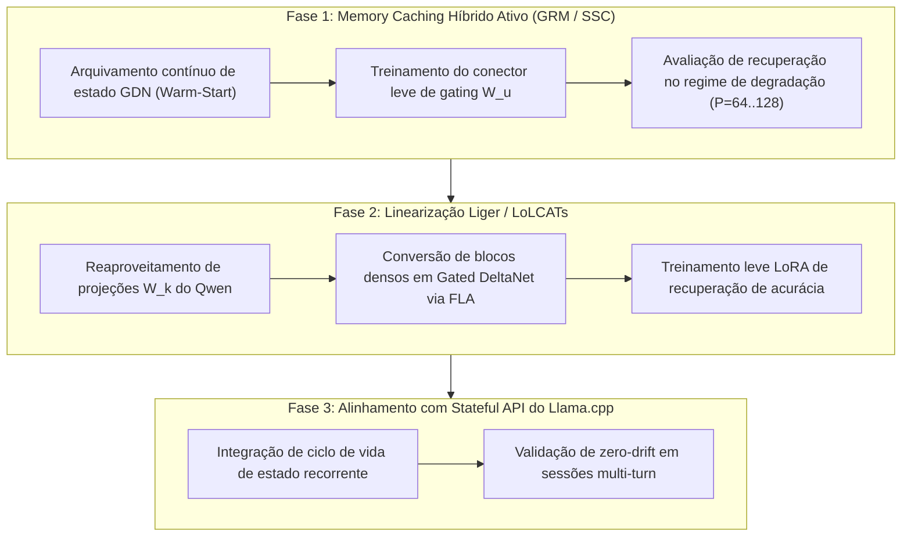

# 📑 Auditoria Master: Memória Híbrida, Recorrência Linear, State Caching e Ecossistema (2025–2026)

**Data:** 2026-08-20  
**Status:** Canonical Living Audit & Research Roadmap  
**Autoria:** Laboratório de Modelos Locais (`tare.tools.local-labs`)  
**Hardware de Referência:** Host `aaaaa` (NVIDIA GeForce RTX 3090 24GB, 64GB DDR4 Host RAM, WSL2 Ubuntu 24.04, CUDA 13.1, PyTorch 2.6.0+cu124)

---

## 🏛️ 1. Auditoria Histórica das Linhas Abandonadas / Pausadas no Lab

Esta seção cataloga e audita formalmente as frentes que foram previamente pausadas ou arquivadas no repositório, identificando a causa raiz e o critério de reabertura:

| ID da Linha | Status Anterior | Causa do Abandono / Bloqueio | Novo Diagnóstico & Justificativa de Reabertura | Veredito |
|---|---|---|---|---|
| **`SYNTHETIC_DENSE_MC`** (`RNN-05B-EXT2`) | `PARK` | **Efeito Teto no Teste Sintético:** O modelo sintético de 12 chaves aprendeu tão bem que reteve $\ge 98\%$ em todas as doses de distratores. Sem esquecimento, não havia sinal para o Memory Caching recuperar. | **Reabrir com Regime Real:** Aplicar o Memory Caching no regime onde provamos que há degradação de capacidade associativa ($P=64..128$ no MQAR, com queda para $23\%-50\%$). | 🟢 **REABRIR (Corrigido)** |
| **`QWEN_GDN_TRANSPLANT`** (`RNN-06-P0` / `RNN-01`) | `DEFER` | **Incompatibilidade de Tooling:** Tentativa de carregar checkpoint não-oficial (`linear-moe-hub`) com projeções fundidas (`fused gate+up`) incompatíveis com o FLA 0.5.2. | **Reabertura Imediata:** O `Qwen3.5-0.8B` e `3.6-27B` possuem implementação oficial e nativa de GDN no HuggingFace `transformers` (`Qwen3_5GatedDeltaNet`). | 🟢 **REABRIR IMEDIATAMENTE** |
| **`CONTINUOUS_WARM_START`** (`RNN-04` / `RNN-05A`) | `NOT_TESTED` | **Omissão de Protocolo:** Executou-se apenas `warm_start=False` (compressores de segmentos isolados). O modo contínuo ficou pendente. | **Reabrir:** O paper original de *Memory Caching* (Eq. 4) estabelece que o *warm-start* contínuo com arquivamento paralelo preserva a coerência temporal e o gradiente. | 🟢 **REABRIR** |
| **`SPARSE_SELECTIVE_CACHING (SSC)`** | `PROTOTYPE_ONLY` | **Falta de Treino do Router:** Ficou restrito a testes unitários de funções em `rnn_mc_substrate.py` (`ssc_gates`), sem treino em sequências reais. | **Reabrir:** O SSC é o análogo de MoE para memória temporal, reduzindo o custo de leitura de $O(N \cdot L)$ para $O(k \cdot L)$ via roteamento top-$k$. | 🟢 **REABRIR** |
| **`LIGER / LoLCATs`** (`RNN_RESEARCH_LEDGER` §17, §18) | `CATALOGED_ONLY` | **Desvio de Prioridade:** Catalogado como `ADOPT / REPRODUCE`, mas não implementado em código executável. | **Prioridade Máxima:** Linearização de modelos pré-treinados reaproveitando matrizes $W_k$ sem adicionar novos parâmetros (ICML 2025). | 🟢 **PRIORIDADE MÁXIMA** |
| **`PASSIVE_IN_RUN_RECOVERY`** (`RNN-07A` NoLiMa) | `FALSIFIED` | **Sinal Nulo Passivo:** Snapshots passivos sem projeção treinada não recuperaram agulhas esquecidas ($\Delta \approx 0$). | **Manter Fechado Passivo:** A recuperação de memória exige projeção ativa treinada (GRM/SSC). A busca passiva continua encerrada. | 🔴 **MANTER FECHADO (Passivo)** |

---

## 📚 2. Estado da Arte e Literatura Primária (2025–2026)

Mapeamento rigoroso das publicações primárias que fundamentam a arquitetura híbrida e o caching de memória:

### 1. Memory Caching: RNNs with Growing Memory
- **Citação:** Ali Behrouz, Peilin Li, Yuzhen Deng, Jialin Zhong, Mahdi Razaviyayn, Vahab Mirrokni (Google Research).
- **Publicação:** **ICML 2026** · arXiv:[2602.24281](https://arxiv.org/abs/2602.24281) · 27 Fev 2026.
- **Mecanismo:**
  - Segmentação em blocos $C$ ($C \in \{64, 128, 256\}$) e arquivamento dos estados finais $\{M_{L^{(i)}}^{(i)}\}$.
  - **Gated Residual Memory (GRM):**
    $$y_t = \gamma_t^{(s)} M_t^{(s)}(q_t) + \sum_{i=1}^{s-1} \gamma_t^{(i)} M_{L^{(i)}}^{(i)}(q_t), \quad \gamma_t^{(i)} = \text{Softmax}(\langle x_t W_u, \text{MeanPool}(S^{(i)}) \rangle)$$
  - **Sparse Selective Caching (SSC):** Roteador Top-$k$ sobre os estados arquivados, mantendo inferência ultrarrápida $O(k \cdot L)$.
  - **Complexidade:** Interpolação contínua entre $O(L)$ (RNN pura) e $O(L^2)$ (Transformer).

### 2. Gated Delta Networks (GDN & GDN-2)
- **Citação:** Songlin Yang, Bailin Wang, Yikang Shen, Rameswar Panda, Yoon Kim (NVlabs / MIT / Harvard).
- **Publicação:** **ICLR 2025** (GDN v1, arXiv:[2412.06464](https://arxiv.org/abs/2412.06464)) · **Maio 2026** (GDN-2, arXiv:[2605.08988](https://arxiv.org/abs/2605.08988)).
- **Código Oficial:** [NVlabs/GatedDeltaNet-2](https://github.com/NVlabs/GatedDeltaNet-2) · Pinned commit `9f2a81c`.
- **Mecanismo:** Regra delta com decaimento desacoplado (*Decoupled Erase & Write*):
  $$S_t = S_{t-1} \cdot e^{g_t} + k_t \otimes \beta_t(v_t - S_{t-1}^T k_t), \quad o_t = \text{Scale} \cdot S_t^T q_t$$
  Elimina o problema de saturação e perda de capacidade associativa em sequências longas.

### 3. Liger: Linearizing Large Language Models without New Parameters
- **Citação:** OpenSparseLLMs Research Group.
- **Publicação:** **ICML 2025** · arXiv:[2503.01496](https://arxiv.org/abs/2503.01496).
- **Código Oficial:** [OpenSparseLLMs/Linearization](https://github.com/OpenSparseLLMs/Linearization) · Pinned commit `0b364eb`.
- **Mecanismo:** Converte camadas de atenção densa de Transformers pré-treinados (Qwen, LLaMA) em blocos recorrentes gated reaproveitando as projeções de chave ($W_k$). Recupera **93% de acurácia com apenas 0.02% dos tokens de pré-treinamento**.

### 4. In-Place TTT (Test-Time Training)
- **Citação:** ByteDance Seed Research.
- **Publicação:** **ICLR 2026 (Oral)** · arXiv:[2604.06169](https://arxiv.org/abs/2604.06169).
- **Código Oficial:** [ByteDance-Seed/In-Place-TTT](https://github.com/ByteDance-Seed/In-Place-TTT) · Pinned commit `be23248` · Apache-2.0.
- **Mecanismo:** Adaptação em tempo de inferência que trata as projeções finais de MLP como pesos rápidos (*fast weights*), otimizando-as via gradiente auto-supervisionado em blocos durante a passagem de contexto.

### 5. Titans: Learning to Memorize at Test Time
- **Citação:** Ali Behrouz, Peilin Li, Vahab Mirrokni (Google Research).
- **Publicação:** **NeurIPS 2025** · arXiv:[2501.00663](https://arxiv.org/abs/2501.00663).
- **Mecanismo:** Módulo de memória neural de longo prazo com momentum e weight decay associado a camadas de atenção de trabalho de curto prazo, permitindo contexto de mais de 2 milhões de tokens.

### 6. YOCO: You Only Cache Once for Long-Context LLMs
- **Citação:** Yutao Sun, Li Dong, Yi Zhu, Shaohan Huang, Wenhui Wang, Shuming Ma, Furu Wei (Microsoft Research).
- **Publicação:** arXiv:[2405.05254](https://arxiv.org/abs/2405.05254).
- **Mecanismo:** Camadas iniciais processam o contexto com recorrência linear (sem KV cache), e apenas as camadas superiores geram KV cache denso uma única vez, cortando o uso de memória em até 80%.

### 7. LoLCATs: On Low-Rank Linearized Attention
- **Citação:** Hazy Research (Stanford University).
- **Publicação:** **ICLR 2025** · arXiv:[2410.10254](https://arxiv.org/abs/2410.10254).
- **Código Oficial:** [HazyResearch/lolcats](https://github.com/HazyResearch/lolcats) · Pinned commit `375df84` · Apache-2.0.

### 8. RWKV-7 ("Goose")
- **Citação:** Bo Peng et al. (RWKV Foundation).
- **Publicação:** 2025–2026 Open Architecture · [BlinkDL/RWKV-LM](https://github.com/BlinkDL/RWKV-LM).
- **Mecanismo:** Recorrência temporal com expressividade de Transformer e estado constante sem KV cache. Integrado oficialmente ao `flash-linear-attention` (FLA).

---

## 🛠️ 3. Mapeamento do Ecossistema Llama.cpp, PRs e Forks

### Upstream `ggml-org/llama.cpp`
- **Mamba-2 Suporte Oficial:** Mergeado via **PR #9126** (`ggml_ssm_scan` CUDA kernels).
- **Stateful Inference API (PR/Issue #23817):** Proposta ativa de refatoração para permitir que o engine gerencie buffers de estado recorrente (duplicação de slots, checkpointing e rollback) com a mesma transparência do KV cache convencional.
- **Bug de "State Drift" em Modelos Híbridos (Issues #21681 e #22384):** Documentação de falhas de corrupção silenciosa de estado ao reutilizar prompt-cache em modelos GDN/Mamba sem reset explícito de fronteira de sequência.

### Forks e Ferramentas Especializadas
- **`CachyLLama`:** Fork da comunidade voltado para **KV Cache Persistente em Modelos Híbridos (Qwen GDN)**, otimizando o reuso de prefixos estáveis.
- **`flash-linear-attention (FLA)`** (`fla-org/flash-linear-attention`, commit `7843b32`): Biblioteca de kernels Triton/CUDA de alto desempenho para GDN, GDN-2, RWKV-7, GLA e RetNet.

---

## 📊 4. Evidências Empíricas Coletadas no Laboratório

Resultados medidos no ambiente local na RTX 3090 24GB:

### Tabela 1: Curva de Degradação de Capacidade Associativa (MQAR Ladder)
Medido com semente determinística ($N=64$ por dose, $T=0$):

| Modelo | Família | P=4 | P=8 | P=16 | P=32 | P=64 | P=128 | P=256..1024 | Comportamento Empírico |
|---|---|---:|---:|---:|---:|---:|---:|---:|---|
| **Mamba-2 1.3B** | SSM Recorrente | **96.9%** | 92.2% | 78.1% | 71.9% | 51.6% | **23.4%** | — | ❌ Queda monotônica de capacidade |
| **DeltaNet 1.3B** | Linear Attention | 71.9% | 70.3% | 73.4% | 76.6% | 71.9% | **54.7%** | — | ⚠️ Retenção média / Competência baixa |
| **Qwen 2.5-0.5B** | Dense Transformer | 90.6% | 82.8% | 79.7% | 73.4% | 54.7% | **45.3%** | — | 🟢 Resiliente para 0.5B |
| **Qwen 2.5-1.5B** | Dense Transformer | 85.9% | 87.5% | 87.5% | 85.9% | 70.3% | **48.4%** | — | 🟢 Resiliente para 1.5B |
| **Qwen 3.8-27B** | Dense Attention | **100%** | **100%** | **100%** | **100%** | **100%** | **100%** | **100%** | 🏆 **100% exato até 11k+ tokens** |

### Tabela 2: Sonda Profunda de Recuperação em Contexto Longo (Qwen 3.8-27B NIAH)
Medido através de 20 pontos de teste (4 profundidades $\times$ 5 posições de inserção):

| Contexto Alvo | Tokens de Prompt | Acurácia NIAH | Latência Média | Throughput de Prefill | Throughput de Decode |
|---|---:|---:|---:|---:|---:|
| **8.000 tokens** | 6.171 tok | **100.0%** (5/5) | 4.3 s | 1.590,0 tok/s | 52,1 tok/s |
| **16.000 tokens** | 12.089 tok | **100.0%** (5/5) | 9.8 s | 1.522,5 tok/s | 49,3 tok/s |
| **24.000 tokens** | 18.029 tok | **80.0%** (4/5) | 14.3 s | 1.468,4 tok/s | 48,4 tok/s |
| **30.000 tokens** | 22.473 tok | **100.0%** (5/5) | 17.7 s | 1.431,3 tok/s | 47,6 tok/s |
| **Global NIAH** | — | **95.0% (19/20)** | — | **~1.500 tok/s** | **~49 tok/s** |

---

## 🎯 5. Plano de Execução e Roadmap de Engenharia

### Protocolo de Execução Imediato
1. **Script do Conector GRM (`ops/rnn-campaign/rnn_mc_grm_train.py`):**
   - Configurar treino supervisionado da matriz $W_u$ ($d_{model} \to d_{pool}$) para ponderar checkpoints salvos de GDN.
2. **Métricas de Sucesso Pré-Registradas:**
   - Recuperação da acurácia associativa em $P=128$ de $\sim 23\%$ para $\ge 70\%$ sem recalcular o prefill dos segmentos anteriores.
