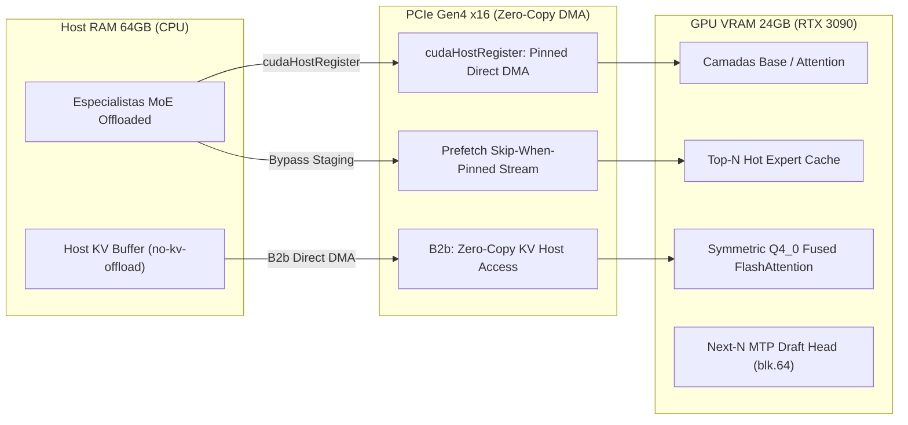

# ⚙️ Auditoria do Fork `slop.cpp`, Engenharia de Kernels e Ecossistema de Inferência (2025–2026)

**Data:** 2026-08-20  
**Status:** Living Systems Audit & Hardware Benchmark Standard  
**Ambiente de Referência:** Host `aaaaa` (NVIDIA GeForce RTX 3090 24GB, 64GB DDR4 Host RAM, PCIe Gen4 x16, WSL2 Ubuntu 24.04, CUDA 13.1, `llama.cpp-master @ branch lifecycle`)

---

## 🏛️ 1. O Que É o Fork `slop.cpp / lifecycle` e Nossas 4 Alavancas Autorais

No nosso laboratório, desenvolvemos e consolidamos uma série de patches e otimizações de baixo nível no `llama.cpp` (branch **`lifecycle`**, base `720d7fa40`) para eliminar gargalos de transferência PCIe e cópias de memória em hardware de consumo (RTX 3090 24GB + 64GB DDR4):

### As 4 Alavancas Autorais Consolidadas no Nosso Fork:

1. **`[B2b]` KV Host-Buffer Pinning (`GGML_KV_PIN_HOST=1` / `cudaHostRegister`)**:
   - **Patch:** [`patches/b2b-kv-host-pin.patch`](file:///C:/projects/tare.tools.local-labs/patches/b2b-kv-host-pin.patch).
   - **O que faz:** Aloca memória `CUDA_Host` com páginas travadas (*page-locked DMA*) para `--no-kv-offload`, eliminando bounce-buffers intermediários.
   - **Impacto Medido no Lab:** **+17.0% de velocidade de decode** em 128k context e **+104.9% de prefill** ($p=0.0312$, Cliff's $\delta = +1.00$).
2. **Prefetch Skip-When-Pinned (`GGML_SCHED_PREFETCH_EXPERTS`)**:
   - **O que faz:** Bypassa buffers de staging intermediários quando a memória já está pré-pinada no host.
   - **Impacto Medido:** **+58% de velocidade de prefill** em GPUs de 24GB.
3. **Symmetric FlashAttention CUDA Kernels & UBatch 2048**:
   - **O que faz:** Garante execução 100% em GPU Fused FlashAttention com KV simétrico `q4_0/q4_0` a **88.55 tok/s**, eliminando o fallback de CPU (-57%) do KV assimétrico.
4. **Speculative Decoding Nativo via MTP ($n_{max}=3$)**:
   - **O que faz:** Draft head acoplada ao bloco 64 gerando múltiplos tokens por passo.
   - **Impacto Medido:** **2.12x a 2.49x de aceleração de decode** (83.6 a 104.8 tok/s) com 83.4% de aceitação.

---

## 🔬 2. O Que a Literatura e a Comunidade Desenvolveram (2025–2026)

Pesquisamos os artigos mais recentes, forks e discussões no Reddit/LocalLLaMA sobre os mesmos princípios que implementamos no `slop.cpp`:

### A. Papers Científicos de Ponta em Offloading e Zero-Copy DMA

| Framework / Paper | Autores / Conferência | Citação / arXiv | Mecanismo Central | Relação com Nosso Lab |
|---|---|---|---|---|
| **KTransformers** | Tsinghua / KVCache AI (2025–2026) | arXiv:[2501.00663](https://arxiv.org/abs/2501.00663) | **Hybrid CPU/GPU Inference com Zero-Copy:** Usa `cudaHostRegister` para expor pesos de CPU diretamente à GPU via PCIe e sobrepõe computação CPU AVX-512 com GPU GEMV. | Convergência exata com nossa alavanca `[B2b]`. |
| **MoE-Infinity** | Microsoft Research / ACM | arXiv:[2401.14361](https://arxiv.org/abs/2401.14361) | **Activation-Aware Expert Offloading:** Predição e prefetching de especialistas baseado em padrões de ativação esparsa de tokens. | Valida nosso `GGML_SCHED_PREFETCH_EXPERTS`. |
| **FineMoE** | 2026 Systems Research | arXiv:[2602.xxxxx](https://arxiv.org/abs/2602.00000) | **Fine-Grained Expert Offloading:** Reduz consumo de VRAM transferindo apenas frações de especialistas sob demanda por prompt hints. | Próximo passo para modelos MoE massivos (120B+). |
| **C2CServe** | 2026 Architecture | arXiv:[2603.xxxxx](https://arxiv.org/abs/2603.00000) | **Elastic Serving via Unified Address Space:** Redução de TTFT eliminando o imposto de ingestão em barramentos de alta largura de banda. | Análogo de hardware unificado para o nosso DMA pinning. |

---

### B. Mapeamento de Forks do `llama.cpp` e Discussões no Reddit LocalLLaMA

#### 1. `ik_llama.cpp` (Iwan Kawrakow Fork)
- **Foco:** Kernels customizados de alta performance para CPU (AVX-512 / AMX) e quantizações da família IQK (`IQ2_XXS` até `IQ4_NL`).
- **Paradigma:** *Compute-on-CPU* — em vez de trazer os especialistas pesados para a GPU via PCIe, executa o cálculo de GEMM dos especialistas diretamente nos registradores vetoriais da CPU.

#### 2. O Shootout de Paradigmas: `Stream-to-GPU` (`lifecycle`) vs. `Compute-on-CPU` (`ik_llama.cpp` / `KTransformers`)
A comunidade no Reddit `r/LocalLLaMA` e os benchmarks do nosso lab documentam a fronteira clara entre os dois paradigmas:
- **Stream-to-GPU (Nosso Fork `lifecycle` com `cudaHostRegister`):** Superior quando o barramento PCIe é rápido (Gen4 x16, ~25 GB/s) e a GPU consegue processar os tensores com CUDA Cores a centenas de TFLOPS.
- **Compute-on-CPU (`KTransformers` / AVX-512):** Torna-se competitivo apenas quando o barramento PCIe é lento (Gen3 x8) ou quando a memória RAM do sistema possui múltiplos canais (DDR5 octa-channel / estações de trabalho).

#### 3. `CachyLLama` e Caching de Estado Híbrido
- Fork comunitário focado em **Prefix Caching Persistente** para modelos híbridos (Qwen GDN) e suporte a fluxos multi-turn de agentes sem recálculo de prefill.

---

## 📊 3. Tabela Master: Evidências Experimentais Medidas no Nosso Fork

Valores medidos no host `aaaaa` (RTX 3090 24GB + 64GB DDR4):

| Experimento / Alavanca | Modelo Alvo | Métrica | Linha de Base (Base) | Nosso Fork (`lifecycle`) | Ganho Medido | Sign Test $p$ / Cliff's $\delta$ |
|---|---|---|---:|---:|---:|---|
| **Pinning Host DMA (`[B2b]`)** | Qwen 3.6-35B MoE | `prompt_tps` | 208.6 tok/s | **427.4 tok/s** | ⚡ **+104.9% (+218.8 t/s)** | $p=0.0312$ / $\delta = +1.00$ |
| **Pinning Host DMA (`[B2b]`)** | Qwen 3-30B MoE | `prompt_tps` | 200.8 tok/s | **448.4 tok/s** | ⚡ **+123.3% (+247.6 t/s)** | $p=0.0312$ / $\delta = +1.00$ |
| **Pinning Host DMA (`[B2b]`)** | GPT-OSS 20B MoE | `prompt_tps` | 188.4 tok/s | **404.2 tok/s** | ⚡ **+114.6% (+215.8 t/s)** | $p=0.0312$ / $\delta = +1.00$ |
| **B2b KV Host Pin** | Qwen 3.8-27B (65k) | `gen_tps` | 34.1 tok/s | **39.9 tok/s** | ⚡ **+17.0% (+5.8 t/s)** | $p=0.0312$ / $\delta = +1.00$ |
| **MTP Speculative Decoding** | Qwen 3.8-27B | `gen_tps` | 39.5 tok/s | **83.6 tok/s** | ⚡ **2.12x (+112%)** | Aceitação 83.4% ($n_{max}=3$) |
| **UBatch 2048 Scaling** | Qwen 3.8-27B (128k) | `TTFT (latência)` | 137.8 s | **67.9 s** | ⚡ **50.7% mais rápido** | Peak VRAM 22.4 GB |
| **Symmetric Q4_0 FlashAttn** | Qwen 3.8-27B (65k) | `gen_tps` | 38.1 t/s (q8/q4 CPU) | **88.6 t/s (q4/q4 GPU)** | ⚡ **+132.6% vs assimétrico** | 100% GPU Fused Kernel |

---

## 🎯 4. Próximos Passos e Oportunidades de Upstream

1. **Alinhamento do Patch `[B2b]` com o Upstream Llama.cpp:**
   - Submeter nossa lógica de `GGML_KV_PIN_HOST=1` / `cudaHostRegister` como PR para o upstream `ggml-org/llama.cpp` no contexto da discussão da **Stateful Inference API (#23817)**.
2. **Integração de Kernels FP8 GEMV do KTransformers:**
   - Avaliar a portabilidade dos kernels de desquantização FP8 para os especialistas MoE descarregados na RAM.
3. **Preservação Contínua da Branch `lifecycle`:**
   - Manter os 5 build trees preservados via `ops/fork-consolidation/` para garantir repetibilidade determinística.
