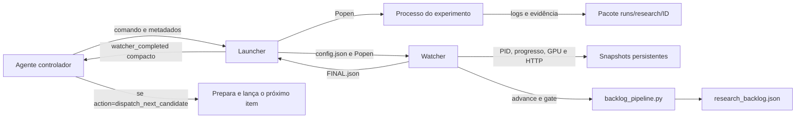

# Watcher de experimentos autônomos

Este documento descreve o watcher implementado em
`tools/analysis/watch_experiment_processes.py` e o launcher associado em
`tools/analysis/launch_watched_experiment.py`. Ele é a referência operacional
para executar trabalhos longos sem perder a conclusão, o estado do backlog ou
a recuperação dos serviços locais.

## O que ele resolve

O watcher liga quatro coisas que antes podiam ficar desconectadas:

1. o processo físico do experimento;
2. o pacote de evidência em `runs/research/<ID>`;
3. a máquina de estados de `backlog_pipeline.py`;
4. o agente controlador que precisa receber a conclusão e continuar a fila.

O objetivo não é decidir se uma hipótese científica está correta. O objetivo é
garantir que o fim do processo seja observado e convertido em um estado
operacional inequívoco, com evidência persistente e comportamento fail-closed.

## Garantias e limites de autoridade

O watcher pode:

- observar se o PID ainda existe no host Windows;
- contar marcadores físicos de progresso no pacote;
- registrar telemetria de GPU e disponibilidade HTTP;
- exigir um `raw/receipt.json` antes de aceitar a execução;
- executar a transição legal `IMPLEMENTED -> EXECUTED`;
- aceitar idempotentemente um pacote que já esteja em `EXECUTED`;
- rodar o gate global do pipeline;
- aguardar por até 180 segundos a recuperação HTTP final;
- recalcular os estados do backlog e o próximo candidato;
- acordar o agente controlador com uma mensagem compacta de conclusão.

O watcher não pode:

- auditar o conteúdo científico do recibo;
- escrever `REVIEW.json`;
- mover um pacote para `VERIFIED`, `PROMOTED` ou `REJECTED`;
- enfraquecer gates ou corrigir evidência bruta;
- escolher um comando de experimento a partir apenas do ID retornado;
- iniciar automaticamente o próximo candidato;
- restaurar serviços por conta própria;
- inferir sucesso apenas porque o processo terminou com rapidez.

O executor continua responsável por produzir evidência e restaurar o ambiente.
O auditor independente continua responsável por conferir a ciência.

### Terminal frugal do harness (opt-in)

Runners novos podem usar `src/model_lifecycle/experiment_harness.py` e produzir
`raw/run.terminal.json`. Um terminal `SEALED` verificado substitui a inferência
legada baseada em `progress_glob`; `ABORTED`, hash divergente ou terminal
malformado param o fluxo sem transição científica. O modo legado permanece
aceito durante a migração, salvo quando o launcher recebe
`--require-harness-terminal`.

O terminal não transforma o watcher em auditor. Ele prova autoconsistência, não
autenticidade contra um executor malicioso: a âncora externa continua sendo a
revisão independente. O watcher exige também `RESULT.md`, identidade concordante
entre configuração, `PIPELINE.json`, receipt e terminal, e um recibo atômico com
o exit code real do worker. Quando exigida, a restauração precisa aparecer como
evento bem-sucedido antes do seal. A saída compacta final inclui
`audit_ready_ids` para que o controlador entregue os pacotes `EXECUTED` ao
auditor independente.

Nesse modo, `--progress-glob` e `--expected-progress` são opcionais: o launcher
usa o próprio terminal como marcador visual. Runners legados continuam obrigados
a declarar ambos os argumentos.

## Componentes

| Componente | Responsabilidade |
|---|---|
| `launch_watched_experiment.py` | Inicia o experimento, inicia o watcher, grava o vínculo entre ambos e mantém a sessão controladora esperando o watcher por padrão. |
| `watch_experiment_processes.py` | Faz polling dos PIDs, progresso, pipeline, GPU e endpoints; finaliza os pacotes e grava o resultado do monitoramento. |
| `backlog_pipeline.py` | É a única autoridade para transições do manifesto e para o gate global. |
| `smoke_experiment_mode.py` | Executa um canário temporário e não mutante pelo caminho completo launcher-watcher-fila. |
| `tests/test_watch_experiment_processes.py` | Exercita o watcher e o launcher com fixtures isoladas, PIDs e pipeline simulados. |

## Arquitetura



O launcher fica em foreground esperando o watcher, não o processo do
experimento. O watcher é quem observa o processo. Essa ligação é o mecanismo
que faz a conclusão voltar para a sessão do agente.

## Fluxo completo

### 1. Pré-condições

Antes do lançamento, o pacote deve estar em `IMPLEMENTED`, com:

- preregistro congelado;
- implementação registrada e hash-bound no `PIPELINE.json`;
- diretório do pacote conhecido;
- um contrato claro de progresso físico;
- comando completo do experimento.

O watcher não prepara nem preregistra o pacote.

### 2. Lançamento do experimento

O launcher primeiro confirma que a tarefa e o diretório correspondem ao pacote
canônico do backlog e que manifesto e `PIPELINE.json` concordam em
`IMPLEMENTED`. Depois cria, em modo exclusivo:

- `runs/research/<ID>/runner.stdout.log`;
- `runs/research/<ID>/runner.stderr.log`.

Se qualquer log já existir, o launcher preserva ambos, grava
`LAUNCH_FAILED.json` com `phase=log_initialization` e exige uma nova tentativa.
Depois inicia o comando com o repositório como diretório de trabalho. No
Windows, usa `CREATE_NEW_PROCESS_GROUP | CREATE_NO_WINDOW`; em POSIX, cria uma
nova sessão. Assim, falha precoce do watcher ou timeout encerra a árvore do
worker, não apenas seu processo pai.

Se o experimento não puder ser iniciado, o launcher grava
`LAUNCH_FAILED.json` com `phase=experiment_spawn` e retorna código 2.

### 3. Lançamento do watcher

Com o PID real do experimento, o launcher escreve `config.json` e inicia o
watcher em outro processo. Se essa segunda criação falhar, o launcher encerra o
experimento para que não exista um job órfão sem monitoramento, grava
`LAUNCH_FAILED.json` com `phase=watcher_spawn` e retorna código 2.

### 4. Polling

O watcher verifica, por experimento:

- existência do PID;
- progresso conforme o contrato explícito `progress_mode` + `progress_glob`;
- estágio em `PIPELINE.json`;
- GPU por `nvidia-smi`;
- status HTTP dos endpoints configurados.

O padrão é 300 segundos. O mínimo aceito é 5 segundos.

`progress_mode=files` conta arquivos correspondentes. `progress_mode=jsonl_lines`
conta linhas não vazias nos JSONL correspondentes. Nunca use a contagem de
arquivos para representar amostras: um `samples.jsonl` com 448 linhas vale 1 em
`files` e 448 em `jsonl_lines`.

`WATCH_STATUS.json` é atualizado a cada ciclo. Um evento `progress` só é
adicionado a `events.jsonl` quando muda pelo menos um destes campos:

- PID vivo/morto;
- contagem de progresso;
- estágio do pipeline.

Mudanças apenas na GPU ou no endpoint aparecem no snapshot mais recente, mas
não geram uma nova linha de progresso. Isso reduz I/O, ruído e consumo de
tokens.

### 5. Detecção do término

Quando o worker termina, o launcher reaproveita o processo e grava
`WORKER_EXIT.json` atomicamente. O watcher então:

1. exige exit code inteiro zero, sem timeout ou falha prévia do watcher;
2. exige `raw/receipt.json`, `RESULT.md` e terminal válido;
3. vincula `task_id`, PID e `run_id` ao recibo de saída;
4. vincula tarefa, `PIPELINE.json`, receipt e terminal;
5. confirma que o pacote é o `packet_dir` canônico do backlog e que os estados concordam;
6. aceita estágio `IMPLEMENTED` ou, idempotentemente, `EXECUTED`;
7. em `IMPLEMENTED`, chama `backlog_pipeline.py advance <ID> --to EXECUTED`;
8. confirma o estágio final e executa `backlog_pipeline.py gate`.

Canários temporários precisam de `--unmanaged-canary`: são validados, mas não
mudam o backlog nem aparecem em `audit_ready_ids`.

### 6. Recuperação final

Depois que todos os processos terminam, o watcher testa novamente os endpoints.
Se algum não retornar HTTP 200, espera em ciclos de 5 segundos por até
`service_settle_seconds`, cujo padrão no launcher é 180 segundos.

Essa verificação testa disponibilidade HTTP, não identidade completa do
serviço. Um experimento que interrompe serving deve registrar no próprio recibo
a identidade inicial/final, PIDs, argumentos, reinícios e saúde de 8081.

### 7. Atualização da fila

O watcher roda:

```powershell
python tools/analysis/backlog_pipeline.py rebalance --apply --actor <actor> --json
python tools/analysis/backlog_pipeline.py status --json
python tools/analysis/backlog_pipeline.py next --json
```

The first command runs only in `--experiment-mode` and applies only strategic
assessments already explicit in the canonical policy. The watcher does not
score results or change scientific state. It persists only the policy digest,
counts and affected IDs; the full explanation remains available through
`backlog_pipeline.py rank --explain` and
[`BACKLOG_PRIORITY_POLICY.md`](BACKLOG_PRIORITY_POLICY.md).

No `--experiment-mode`, falha ao recalcular a fila transforma a conclusão em
alerta. O snapshot final inclui contagens por estado e o objeto completo do
próximo candidato, quando existir.

### 8. Entrega ao controlador

No modo padrão, o launcher espera o watcher e imprime somente dois objetos JSON
compactos:

```json
{"event":"watcher_started","task_id":"BACKLOG-X","watch_id":"WATCH-X","poll_seconds":300}
{"event":"watcher_completed","task_id":"BACKLOG-X","status":"complete","action":"dispatch_next_candidate","next_id":"BACKLOG-Y"}
```

O segundo objeto acorda a sessão controladora. `dispatch_next_candidate` é uma
instrução para o agente, não um subprocesso já lançado. O agente ainda precisa:

1. conferir o candidato e suas dependências;
2. preparar o comando correto;
3. lançar o próximo experimento com outro watcher.

Isso evita que um monitor genérico invente argumentos, execute um item ainda
não preparado ou ultrapasse a autoridade concedida.

## Comando recomendado

```powershell
python tools/analysis/launch_watched_experiment.py `
  --task-id BACKLOG-EXAMPLE-01 `
  --packet-dir runs/research/BACKLOG-EXAMPLE-01 `
  --progress-glob "raw/finalized/*.json" `
  --progress-mode files `
  --expected-progress 4 `
  --watch-id EXPERIMENT-WATCH-2026-08-27-EXAMPLE-R1 `
  --watch-outdir runs/autonomous/EXPERIMENT-WATCH-2026-08-27-EXAMPLE-R1 `
  --experiment-mode `
  -- `
  python tools/research/run_example.py `
  --outdir runs/research/BACKLOG-EXAMPLE-01
```

O separador `--` marca o começo do comando do experimento.

Para progresso armazenado como registros em um único JSONL, use
`--progress-mode jsonl_lines` e mantenha `--expected-progress` na mesma unidade.

## Ondas autônomas congeladas

Uma cadeia longa autorizada não deve depender de o agente interpretar
`dispatch_next_candidate` no instante exato da conclusão. Prepare todos os
pacotes em `IMPLEMENTED`, congele os argv e os contratos de progresso em um
manifesto `local-labs-watched-wave-v1` e entregue a sequência a
`tools/analysis/run_watched_experiment_wave.py`.

```json
{
  "schema": "local-labs-watched-wave-v1",
  "wave_id": "WAVE-2026-08-29-A",
  "poll_seconds": 300,
  "items": [
    {
      "task_id": "BACKLOG-A",
      "command": ["python", "tools/research/run_a.py"],
      "progress": {
        "mode": "jsonl_lines",
        "glob": "raw/samples.jsonl",
        "expected": 448
      }
    },
    {
      "task_id": "BACKLOG-B",
      "command": ["python", "tools/research/run_b.py"],
      "require_harness_terminal": true
    }
  ]
}
```

```powershell
python tools/analysis/run_watched_experiment_wave.py `
  --manifest config/research_trails/WAVE-2026-08-29-A.json `
  --outdir runs/autonomous/WAVE-2026-08-29-A
```

O supervisor executa somente os argv congelados, em ordem. O próximo item parte
apenas após `FINAL.json.status=complete`, presença em `audit_ready_ids` e
concordância `EXECUTED` entre backlog e pacote. Estado e digest do manifesto são
persistidos. A retomada pula itens já validados e recupera a janela de crash
entre o watcher gravar `EXECUTED` e o supervisor registrar a conclusão. Qualquer
alerta para a onda. O supervisor não cria hipóteses, não promove, não faz commit
e não faz push.

### Argumentos do launcher

| Argumento | Obrigatório | Semântica |
|---|---:|---|
| `--task-id` | sim | ID exato no backlog. |
| `--packet-dir` | sim | Pacote do experimento, relativo ao repositório ou absoluto. |
| `--progress-glob` | legado | Glob relativo ao pacote; opcional com terminal obrigatório. |
| `--expected-progress` | legado | Limite mínimo de marcadores; opcional com terminal obrigatório. |
| `--watch-id` | sim | Identidade única desta observação. |
| `--watch-outdir` | sim | Diretório persistente do watcher. Deve ser único por tentativa. |
| `--poll-seconds` | não | Cadência; padrão 300, mínimo efetivo 5. |
| `--max-runtime-seconds` | não | Deadline duro do worker; padrão 86400 (24 horas). |
| `--require-harness-terminal` | não | Exige terminal, receipt, `RESULT.md`, identidade e exit code verificados. |
| `--experiment-mode` | não | Torna a validade da fila parte da conclusão e calcula a ação de continuidade. |
| `--verbose-controller-output` | não | Expõe metadados completos no stdout do controlador. |
| `--detach-watcher` | não | Somente legado; é rejeitado quando o terminal do harness é obrigatório. |

## Contrato dos marcadores de progresso

`progress_glob` não mede porcentagem e não interpreta conteúdo. Ele conta
arquivos. Portanto:

- um marcador deve representar uma unidade realmente finalizada;
- escreva o conteúdo em arquivo temporário e renomeie atomicamente quando
  possível;
- não reutilize nomes entre unidades;
- não crie marcadores antes de validar a saída correspondente;
- escolha `expected_progress` de modo que uma execução parcial não passe;
- prefira um marcador final `complete.json` escrito depois de `RESULT.md` e do
  recibo quando o runner permitir esse contrato.

Exemplo para dois checkpoints:

```text
raw/finalized/checkpoint_seed_1.json
raw/finalized/checkpoint_seed_2.json
```

Com `--expected-progress 2`, apenas um checkpoint concluído gera
`failed_incomplete_progress`.

## Artefatos persistidos

### No pacote do experimento

| Arquivo | Conteúdo |
|---|---|
| `runner.stdout.log` | stdout integral do comando do experimento. |
| `runner.stderr.log` | stderr integral do comando do experimento. |
| `raw/receipt.json` | recibo canônico produzido pelo runner. |
| `RESULT.md` | resumo limitado do executor. |
| arquivos do `progress_glob` | marcadores de unidades finalizadas. |

Os dois logs do runner são abertos com `w`. Uma repetição no mesmo pacote os
sobrescreve; tentativas que precisam preservar logs distintos devem usar
pacotes sucessores ou copiar os logs para evidência antes da nova tentativa.

### No diretório do watcher

| Arquivo | Persistência e finalidade |
|---|---|
| `config.json` | Configuração efetivamente entregue ao watcher. |
| `LAUNCH.json` | PIDs, comando, caminhos e tipo de vínculo com o controlador. |
| `LAUNCH_FAILED.json` | Falha de spawn, quando o experimento ou watcher não inicia. |
| `WATCH_STATUS.json` | Snapshot atual, sobrescrito atomicamente via `.tmp` + replace. Inclui `final` após o término. |
| `events.jsonl` | Linha append-only para início, mudanças, término de cada experimento e término do watcher. |
| `FINAL.json` | Decisão operacional final, escrita atomicamente. |
| `watcher.stdout.log` | stdout interno do watcher. Normalmente vazio. |
| `watcher.stderr.log` | traceback ou diagnóstico interno do watcher. |

Use um `watch-id` e `watch-outdir` novos em cada tentativa. Reutilizar o mesmo
diretório mistura o `events.jsonl` append-only e sobrescreve outros metadados.

## Estados internos do experimento

| Estado | Significado |
|---|---|
| `watching` | PID ainda está sob observação. |
| `executed_valid` | Recibo/progresso existem, transição terminou em `EXECUTED` e o gate passou. |
| `failed_pid_never_observed` | O PID já não existia quando o watcher conseguiu observá-lo pela primeira vez. |
| `failed_no_receipt` | Processo terminou sem recibo. |
| `failed_incomplete_progress` | Recibo existe, mas faltam marcadores. |
| `failed_validation` | Estágio, avanço ou gate não validou. |

O status global é:

- `complete`: todos os itens são `executed_valid`, o gate final passa, os
  endpoints retornam 200 e, em experiment mode, a fila foi lida corretamente;
- `complete_with_alert`: qualquer uma dessas condições falhou.

## Ações de conclusão

| Condição | `completion_action` |
|---|---|
| `complete`, experiment mode e há candidato | `dispatch_next_candidate` |
| `complete`, experiment mode e fila vazia | `notify_queue_empty` |
| `complete`, sem experiment mode | `notify_completion` |
| `complete_with_alert` | `inspect_alert_before_dispatch` |
| status fora do domínio final esperado | `stop_fail_closed` |

Nenhum alerta permite despacho automático.

## Matriz de falhas

| Falha | Código/estado | Efeito |
|---|---|---|
| Experimento não inicia | launcher 2, `LAUNCH_FAILED` | Watcher não é iniciado. |
| Watcher não inicia | launcher 2, `LAUNCH_FAILED` | Experimento é terminado para não ficar órfão. |
| PID nunca observado | `failed_pid_never_observed` | Não finaliza o pacote. |
| Recibo ausente | `failed_no_receipt` | Não avança estado. |
| Progresso insuficiente | `failed_incomplete_progress` | Não avança estado. |
| Estágio inesperado | `failed_validation` | Para fail-closed. |
| `advance` falha | `failed_validation` | Mantém evidência e não despacha próximo. |
| Gate falha | `failed_validation` ou alerta global | Não despacha próximo. |
| Endpoint não recupera em 180 s | `complete_with_alert` | Exige inspeção. |
| Fila inválida em experiment mode | `complete_with_alert` | Não despacha próximo. |
| `FINAL.json` ausente/inválido | launcher 3 se watcher saiu 0 | Controlador recebe falha explícita. |

Em configuração com vários experimentos, um único item inválido torna o
resultado global `complete_with_alert`, embora os outros possam terminar como
`executed_valid`.

## Modo foreground e modo detached

### Foreground, recomendado

É o padrão. O launcher só termina depois do watcher e entrega
`watcher_completed` ao controlador. É a opção necessária quando a expectativa
é que o agente seja avisado e continue a fila.

### Detached

`--detach-watcher` retorna logo após os dois processos iniciarem. A observação
continua em disco, mas não existe entrega ativa para a sessão original. O
launcher imprime um aviso explícito:

```text
WARNING: watcher detached; completion will only be persisted on disk and will not wake the controlling session.
```

Use apenas para runners legados quando outro supervisor externo estiver lendo
`FINAL.json`. O modo `--require-harness-terminal` exige foreground para que o
launcher reaproveite o processo filho e persista seu exit code sem a ambiguidade
de processos zombie no WSL.

## Economia de tokens e ruído

O desenho atual reduz consumo de três formas:

1. polling padrão de cinco minutos;
2. eventos apenas quando a assinatura de progresso muda;
3. stdout do controlador limitado aos eventos compactos de início e fim.

Detalhes ficam em disco. Para acompanhamento humano, leia apenas os campos
necessários de `WATCH_STATUS.json`; não despeje `events.jsonl`, logs do runner e
telemetria completa a cada polling.

Use `--verbose-controller-output` somente para diagnóstico de lançamento ou
integração.

## Configuração direta com múltiplos experimentos

O watcher aceita vários itens em `experiments`, embora o launcher público crie
uma configuração com exatamente um item. Uma configuração direta tem esta
forma:

```json
{
  "schema": "local-labs-experiment-watch-v1",
  "watch_id": "WATCH-BATCH-01",
  "experiment_mode": true,
  "poll_seconds": 300,
  "service_settle_seconds": 180,
  "experiments": [
    {
      "task_id": "BACKLOG-A",
      "pid": 1234,
      "packet_dir": "runs/research/BACKLOG-A",
      "progress_glob": "raw/finalized/*.json",
      "expected_progress": 2
    },
    {
      "task_id": "BACKLOG-B",
      "pid": 5678,
      "packet_dir": "runs/research/BACKLOG-B",
      "progress_glob": "raw/finalized/*.json",
      "expected_progress": 4
    }
  ],
  "final_health_urls": [
    "http://127.0.0.1:8080/health",
    "http://127.0.0.1:8081/health"
  ],
  "actor": "Codex executor watcher"
}
```

Execução direta:

```powershell
python tools/analysis/watch_experiment_processes.py `
  path/to/config.json `
  --outdir runs/autonomous/WATCH-BATCH-01
```

Nesse modo, quem criou os PIDs é responsável por evitar jobs sem watcher se o
watcher falhar ao iniciar. O launcher é mais seguro para o caso comum.

## Testes

### Fixtures isoladas

```powershell
python -m pytest tests/test_experiment_harness.py tests/test_watch_experiment_processes.py -q
```

A bateria possui 130 casos coletados: 56 do harness e 74 do watcher/launcher. Ela cobre:

- detecção de PID vivo e inexistente;
- HTTP saudável e erro de transporte;
- parsing de telemetria GPU, inclusive erro e saída inesperada;
- estágio ausente e existente;
- matriz completa de ações de conclusão;
- avanço limpo e idempotência em `EXECUTED`;
- recibo ausente e progresso incompleto;
- PID nunca observado;
- estágio inesperado, falha de avanço e falha do gate;
- serviço indisponível e recuperação antes do deadline;
- lote misto e processos terminando em tempos diferentes;
- JSON inválido do pipeline;
- falha de atualização da fila;
- launcher foreground e detached;
- falha de spawn em cada fase;
- `FINAL.json` ausente ou inválido;
- encerramento escalonado do grupo/árvore do job órfão, inclusive processo-filho real;
- recusa sem truncamento de logs preexistentes e exigência explícita do modo árvore;
- recusa de pacote fora de `IMPLEMENTED` antes da criação dos logs;
- terminal `SEALED`, `ABORTED`, ausente, malformado e alterado após o seal;
- processo curto concluído pelo terminal, sem depender de observação prévia do PID;
- entrega compacta de `audit_ready_ids` e launcher opt-in sem marcadores redundantes.
- exit code não zero após o seal, timeout, zombie POSIX e recibo de saída inválido;
- vínculo de identidade entre tarefa, pacote, receipt, terminal e worker;
- adulteração semântica re-hash do journal e nomes reservados em subdiretórios.

As fixtures usam repositório temporário, pipeline stubado, PIDs controlados e
sleep removido. Elas não executam modelos nem alteram o backlog real.

### Canário live não mutante

```powershell
python tools/analysis/smoke_experiment_mode.py
```

O canário:

- calcula o SHA-256 do backlog antes e depois;
- cria pacote, recibo e marcador apenas em diretório temporário;
- percorre o launcher em foreground e o watcher real;
- usa polling de 5 segundos para caber no timeout do canário;
- exige entrega de `watcher_completed`;
- exige `FINAL.json` completo;
- exige refresh válido da fila;
- confirma que o backlog não mudou.

Ele testa integração e entrega, não validade científica nem trabalho de GPU.

### Mutação reproduzível

```powershell
python tools/analysis/mutation_test_experiment_harness.py
```

O gate executa 76 mutantes semânticos em cópias temporárias, falha se algum
sobreviver ou se uma substituição deixar de localizar exatamente um operador e
grava o relatório completo em
`runs/benchmarks/HARNESS-MUTATION-2026-08-28/report.json`.

## Diagnóstico operacional

### Estado compacto

```powershell
$status = Get-Content runs/autonomous/<WATCH-ID>/WATCH_STATUS.json -Raw | ConvertFrom-Json
$status.experiments | Select-Object task_id,process_alive,progress,expected_progress,pipeline_stage,watch_status
$status.gpu
$status.health
```

### Conclusão

```powershell
Get-Content runs/autonomous/<WATCH-ID>/FINAL.json
```

### Eventos relevantes

```powershell
Get-Content runs/autonomous/<WATCH-ID>/events.jsonl | Select-Object -Last 10
```

### Logs do trabalho

```powershell
Get-Content runs/research/<BACKLOG-ID>/runner.stdout.log -Tail 100
Get-Content runs/research/<BACKLOG-ID>/runner.stderr.log -Tail 100
```

### Processo e GPU

```powershell
Get-Process -Id <PID> -ErrorAction SilentlyContinue
nvidia-smi
```

## Limitações conhecidas

- O watcher trata processos Windows e POSIX/WSL, inclusive zombies, mas runners
  detached legados não possuem o vínculo forte de exit code do modo foreground.
- Um watcher manual sem `worker_exit_path` conserva o contrato legado de PID e
  progresso; ele não deve ser usado para novos runners do harness.
- Hashes locais provam autoconsistência, não autenticidade contra um executor
  malicioso; essa autoridade permanece com a auditoria independente.
- Existe risco residual de reutilização de PID em configurações legadas; no modo
  novo, `run_id`, PID, task e recibo de saída precisam concordar.
- O parser de GPU pressupõe a saída de uma única GPU com cinco campos. Em host
  multi-GPU, a saída pode ser preservada apenas como `raw`.
- Saúde final significa HTTP 200. Conteúdo semântico e identidade do serviço
  pertencem ao recibo do experimento.
- O launcher fixa os endpoints 8080 e 8081. Apenas uma configuração direta pode
  fornecer outra lista.
- O schema de `config.json` é um contrato operacional, não passa hoje por um
  validador JSON Schema separado; chaves ausentes podem encerrar o watcher com
  traceback.
- `dispatch_next_candidate` não executa o próximo item; depende do agente
  controlador ativo.
- O launcher suporta um experimento por chamada. Multi-experimento exige
  configuração direta e disciplina adicional de lifecycle.

## Checklist do operador

Antes:

- [ ] pacote em `IMPLEMENTED`;
- [ ] pipeline gate passando;
- [ ] runner e argumentos verificados;
- [ ] `progress_glob` e `expected_progress` representam trabalho completo;
- [ ] `watch-id` e diretório únicos;
- [ ] baseline de 8080/8081 e GPU conhecido.

Durante:

- [ ] launcher foreground ainda vinculado;
- [ ] PID observado vivo;
- [ ] progresso aumenta nos marcos esperados;
- [ ] nenhuma leitura ruidosa abaixo da cadência necessária.

Depois:

- [ ] `FINAL.json.status == complete`;
- [ ] estado individual `executed_valid`;
- [ ] pacote em `EXECUTED`;
- [ ] gate global passando;
- [ ] endpoints finais HTTP 200;
- [ ] `completion_action` tratado pelo controlador;
- [ ] pacote entregue a auditor independente, sem autopromoção.
